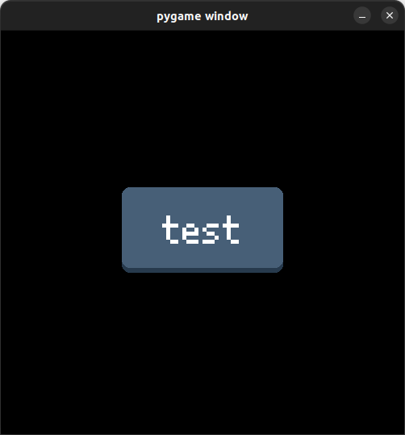
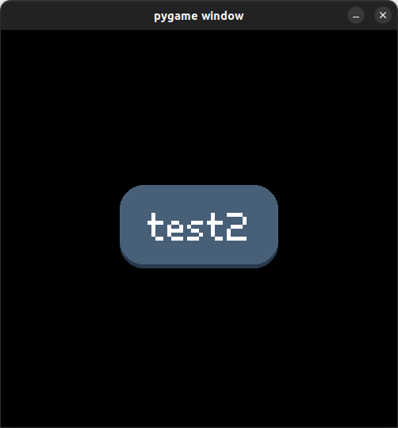

# simplepgbutton
A simple Pygame button module to create an customizale button.

## Usage
- create an Button - minimal with (text, (width, height), x:pos, y_pos)

## Modify
>- hovercolor (color shown when mouse is hovering over the button)
>- textcolor
>- shadowcolor (the color of the bottom part)
>- font
>- elevation (how high the button seems to be)
>- border_rad (higher --> button becomes rounder)

# Examples
``` python
b_width, b_height = 200, 100
test = SimplePgButton("test", (width/2-b_width/2, height/2-b_height/2), b_width, b_height, border_rad=10)
```
>

``` python
test = SimplePgButton("test2", (width/2-b_width/2, height/2-b_height/2), b_width, b_height, <strong>border_rad=30</strong>, <strong>elevation=5</strong>)
```


